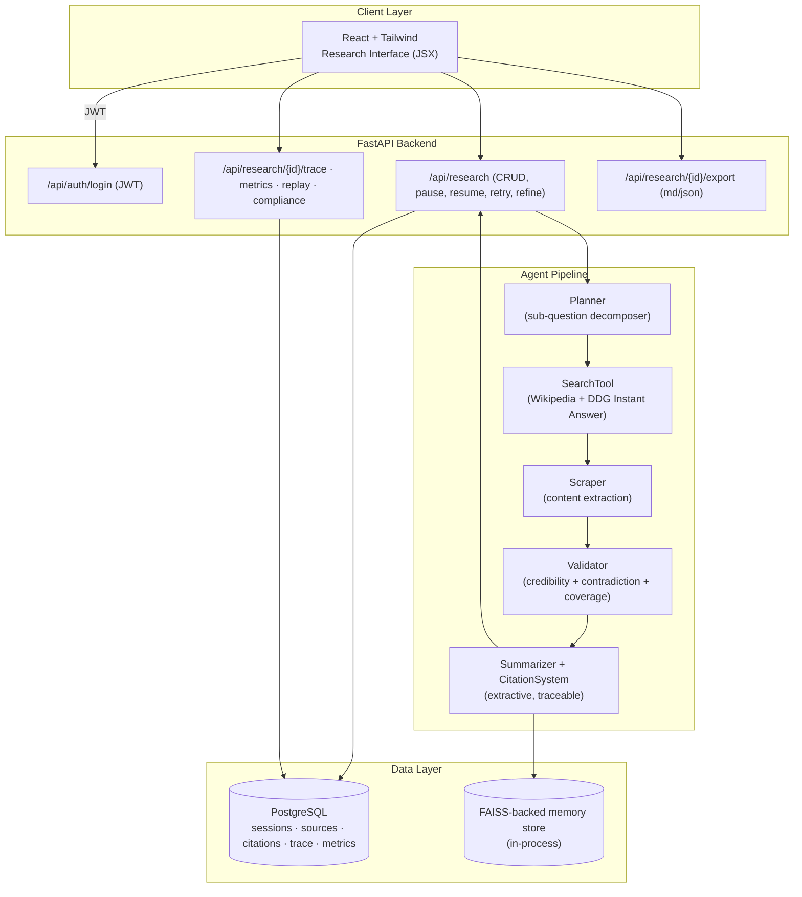

# Europa

**Autonomous Research & Intelligence Agent** — a student portfolio project exploring agentic pipeline design, evidence-cited reporting, and full-stack engineering.

[**🖼️ UI / Portfolio Preview →**](https://www.perplexity.ai/computer/a/europa-preview-project-4-of-9-lCA5DWRgQoa4AN6VYPXAUQ) *(static design preview, not a live deployment)*

> An autonomous multi-step research agent that decomposes a natural-language query into sub-tasks, runs them through a planner → search → extract → validate → synthesize pipeline, and produces a structured report with cited sources, confidence rationale, and contradiction flags. **All outputs require human verification before any decision-making use.**

---

## 🎬 Recruiter Demo in 2 Minutes

The fastest path to evaluate this project — no Docker, no API keys, no database, no network:

```bash
git clone https://github.com/RyanJBush/Autonomous-research-and-intelligence-agent.git
cd Autonomous-research-and-intelligence-agent
python scripts/demo_pipeline.py
```

The script loads `data/sample/sample_sources.json` (mock sources), runs the planner, citation system, and summarizer in-process, and prints the resulting plan, source credibility table, citation excerpts, and a summary preview. Total runtime: under five seconds.

For a deeper look:

1. Skim **[docs/architecture.md](docs/architecture.md)** — pipeline stages and the trust/report model
2. Skim **[backend/app/services/](backend/app/services/)** — `planner.py`, `validator.py`, `reporting.py`, `research_service.py`
3. Read **[docs/resume-bullets.md](docs/resume-bullets.md)** for ATS-friendly bullets pulled from this work
4. See **[docs/demo-runbook.md](docs/demo-runbook.md)** for the full local demo walkthrough

---

## 📌 Project Snapshot

Verified facts only — every entry is grounded in the current contents of this repo.

| Field | Value |
|---|---|
| **Project name** | Europa (internal/legacy name: Astra AI) |
| **Type** | Student portfolio project — not a product, not deployed |
| **Author** | Ryan Bush, University of Maryland Information Science |
| **Backend** | FastAPI (Python 3.11+) with JWT auth, SQLAlchemy, PostgreSQL |
| **Frontend** | React 19 + Vite + Tailwind CSS (JSX, not TypeScript) |
| **Agent pipeline** | Five stages: plan → search → extract → validate → synthesize |
| **Search tool** | Live HTTP calls to Wikipedia OpenSearch + DuckDuckGo Instant Answer API; **not** Brave/Tavily/SerpAPI |
| **Demo data** | Mock sources in `data/sample/sample_sources.json` |
| **Summarization** | Extractive (sentence-selection); no LLM call is wired in by default |
| **Tests** | 120 backend test functions (pytest) — `make test` |
| **Lint** | ruff (backend), eslint + prettier (frontend) |
| **CI** | GitHub Actions: ruff, mypy (non-blocking), pytest, frontend lint + build |
| **Containerization** | `docker-compose.yml` with Postgres 16, backend, frontend |
| **License** | MIT |

---

## 🎯 What This Project Demonstrates

This is a runnable, tested demonstration of how I think about agent design, NLP, retrieval, and full-stack engineering. It is **not** a product; it is a learning exercise made transparent enough that a reviewer can verify every claim against the code.

- **Agentic pipeline design** — explicit stages (planning, retrieval, extraction, validation, synthesis), each traced and individually testable.
- **Evidence-first reporting** — a versioned `ReportSchema` with provenance, claims linked to source excerpts, an evidence-coverage metric, and an unsupported-claim list, so it is auditable *which* parts of the output have support and which do not.
- **Composable trust signals** — credibility scoring combines domain authority, recency, corroboration, and contradiction penalty into a single confidence rationale that is surfaced (not hidden) in the report.
- **FastAPI + SQLAlchemy + Postgres backend** — research sessions, sources, citations, trace events, and per-agent run metrics modeled as first-class entities so the pipeline can be replayed.
- **React + Tailwind research UI** — query input, sub-task decomposition view, source credibility cards, evidence table, contradictions panel, and Markdown/JSON export.
- **Engineering discipline** — 120 backend test functions, ruff + eslint + prettier in CI, Dockerized local stack, and an explicit "Limitations & Future Work" section instead of marketing.

---

## 🏗️ Architecture (high-level)



Full pipeline stage descriptions, schema versioning, and trust model are in **[docs/architecture.md](docs/architecture.md)**.

---

## 📷 Screenshots / Demo

Screenshot placeholders live under **[docs/screenshots/](docs/screenshots/)**. The intended captures for a recruiter walkthrough are:

| Screenshot | What it shows |
|---|---|
| `01-query-input.png` | Research Query page — prompt, breadth/depth/recency controls, allow/deny domains |
| `02-task-decomposition.png` | Sub-question plan rendered before retrieval starts |
| `03-source-cards.png` | Retrieved sources with credibility, domain, recency, and excerpt |
| `04-final-cited-report.png` | Final report with cited findings, confidence rationale, and contradiction flags |
| `05-api-docs.png` | FastAPI auto-generated Swagger UI at `/docs` |

See **[docs/screenshots/README.md](docs/screenshots/README.md)** for capture instructions. The text-only demo (`python scripts/demo_pipeline.py`) is the lowest-friction way to see the agent's I/O without screenshots.

---

## 🛠️ Key Technical Highlights

- **Five-stage agent pipeline** with per-stage tracing (`ResearchTraceEvent`) and per-agent metrics (`AgentRunMetric`), so latency and behavior can be inspected per run.
- **Structured `ReportSchema`** (`backend/app/services/reporting.py`) — versioned, with `provenance`, `findings`, `claims`, `claim_evidence_links`, `evidence_coverage`, and contradiction entries with severity.
- **Componentized confidence scoring** — base source credibility + corroboration bonus + recency bonus − contradiction penalty, with the breakdown surfaced in the report rather than collapsed into one opaque number.
- **Role-gated tool registry** (`backend/app/services/tool_registry.py`) — a lightweight authorization layer that controls which pipeline tools each user role can invoke.
- **PII redaction** (`backend/app/services/pii_redactor.py`) — emails, phone numbers, SSNs are scrubbed from extracted content, with redaction counts surfaced via the `compliance` endpoint.
- **FAISS-backed in-process memory store** (`backend/app/services/memory_store.py`) — vector entries are written per session and retrievable via `/api/memory/{research_id}`.
- **Replay endpoint** — every run can be reconstructed deterministically from its trace events plus inputs.
- **Markdown and JSON report export** — the same structured report renders to either format from a single source of truth.

---

## ⚠️ Limitations — read before evaluating

This project is honest about what it does and does not do. The table below is the short version; longer discussion is in [docs/architecture.md](docs/architecture.md).

| Area | Status | What this means |
|---|---|---|
| **Production readiness** | ❌ Not production-ready | Student portfolio project. No deployment, no SLAs, no users. |
| **Fact-checking** | ⚠️ Not a fact-checker | Confidence scores and evidence-coverage are heuristics over retrieved text. They reduce — they do **not** eliminate — hallucination risk. All outputs require human verification. |
| **Search backends** | ⚠️ Lightweight only | Default `SearchTool` calls Wikipedia OpenSearch and DuckDuckGo Instant Answer over the network. The demo script uses mock data and no network. Brave / Tavily / SerpAPI are **not** wired in. |
| **Summarization** | ⚠️ Extractive, not LLM-abstractive | The default summarizer selects sentences; no LLM call is wired into the default pipeline. |
| **Execution model** | ⚠️ Synchronous | The agent runs inside the HTTP request. Long queries hold the connection. A real deployment would use a job queue. |
| **TypeScript** | ⚠️ Not used | Frontend is JSX (React 19 + Tailwind), not TypeScript, despite earlier README copy that said otherwise. |
| **Authentication** | ⚠️ Demo-grade | JWT works, but local-dev mode auto-creates a user on first login. Do not expose this backend to the public internet as-is. |

### Future work

- Async job queue (Celery / RQ) so the agent can run beyond a single HTTP request
- Pluggable retrieval backends (Brave / Tavily / SerpAPI) behind a single `SearchTool` interface
- LLM-backed abstractive summarization as an alternative to the extractive default
- Richer evaluation: a small labeled set + per-pipeline-stage accuracy metrics
- Per-source freshness decay in the credibility scorer
- Migrate frontend to TypeScript

---

## 📝 Resume Bullets (ATS-friendly)

Five to eight short bullets you can paste directly into a resume. Full list with role-tailored variants in **[docs/resume-bullets.md](docs/resume-bullets.md)**.

- Built an autonomous multi-step research agent in Python and FastAPI that decomposes natural-language queries, retrieves and scores sources, and produces cited evidence-based reports.
- Designed and implemented a five-stage agent pipeline (plan → search → extract → validate → synthesize) with per-stage tracing, retries, and per-agent metrics.
- Authored a versioned structured-report schema (provenance, claim-to-evidence links, evidence-coverage metric, contradiction severity) to make agent output auditable and reduce hallucination risk.
- Implemented a source-credibility scorer combining domain authority, recency, corroboration, and contradiction penalty into a transparent confidence rationale.
- Built a FastAPI backend with JWT auth, SQLAlchemy, PostgreSQL, role-based access, research history, replay endpoint, and Markdown/JSON report export.
- Wrote 120 backend test functions covering planner, validator, reporting, services, and API contracts; integrated ruff, mypy, eslint, and prettier in GitHub Actions CI.
- Added PII redaction (emails, phone numbers, SSNs) and a per-workspace audit log to make agent runs auditable and compliance-friendly.
- Shipped a React + Tailwind research interface (query input, sub-task plan, source cards, evidence table, contradictions panel, Markdown/JSON export) and a Dockerized local stack.

---

## 🚀 How to Run Locally

### Option A — Text-only demo (recommended first run, no setup)

```bash
python scripts/demo_pipeline.py
```

Runs the planner, citation system, and summarizer against `data/sample/sample_sources.json`. No database, no network, no API keys.

### Option B — Full stack via Docker Compose

```bash
docker compose up --build
# Backend API docs (Swagger): http://localhost:8000/docs
# Frontend:                    http://localhost:5173
```

The `backend` service waits for Postgres to be healthy; the `frontend` service waits for the backend `/health` check.

### Option C — Manual local development

```bash
# Backend
cd backend
pip install -e .[dev]
cp .env.example .env       # set ASTRA_JWT_SECRET to anything non-default
uvicorn app.main:app --reload

# Frontend (in a separate shell)
cd frontend
cp .env.example .env
npm ci
npm run dev
```

### Quality gates

```bash
make lint    # ruff + eslint + prettier check
make test    # pytest (backend) + vite build (frontend)
make smoke   # full set: lint + test + frontend build
```

Detailed operator checklist: **[docs/demo-runbook.md](docs/demo-runbook.md)**.

---

## 🗂️ Repository Structure

```
backend/    FastAPI API, agent pipeline, planner / validator / reporting, 120 tests
frontend/   React + Tailwind research UI (JSX)
data/       Mock sources and an illustrative sample report (demo only)
docs/       Architecture, API reference, demo runbook, resume bullets, screenshots
scripts/    Standalone demo entry points (no DB, no network)
.github/    CI workflows, issue / PR templates
```

---

## 📚 Docs

- **[docs/architecture.md](docs/architecture.md)** — pipeline stages, trust model, report schema
- **[docs/api.md](docs/api.md)** — backend API reference (auth, research lifecycle, observability, export)
- **[docs/demo-runbook.md](docs/demo-runbook.md)** — end-to-end demo walkthrough and operator checks
- **[docs/resume-bullets.md](docs/resume-bullets.md)** — ATS-friendly bullets, role-tailored
- **[docs/screenshots/README.md](docs/screenshots/README.md)** — screenshot capture instructions

---

## 📊 Project Status

| Aspect | Status |
|---|---|
| Backend pipeline | ✅ Implemented, 120 tests, CI green |
| Frontend SPA | ✅ Implemented (JSX, not TS) |
| Docker Compose | ✅ Working locally |
| CI (ruff, pytest, frontend build) | ✅ GitHub Actions |
| Public deployment | ❌ None — local-only |
| LLM-backed summarization | ❌ Extractive only |
| Live web-search providers (Brave/Tavily) | ❌ Not wired in |
| Async job queue | ❌ Planned |
| Screenshots in `docs/screenshots/` | ⏳ Placeholders — capture pending |

This project is **feature-complete for its stated portfolio scope**. Active maintenance is on a best-effort basis.

---

## 🎓 Project Context

Built by **Ryan Bush**, University of Maryland Information Science (General Business minor; prior Electrical Engineering coursework), as a portfolio project to practice agentic system design, NLP, and full-stack engineering. It is a student-built learning project, not a product, and not deployed to real users.

Suggested GitHub topics: `autonomous-agent`, `research-assistant`, `nlp`, `information-retrieval`, `summarization`, `fastapi`, `python`, `portfolio-project`.

---

## 📄 License

MIT
