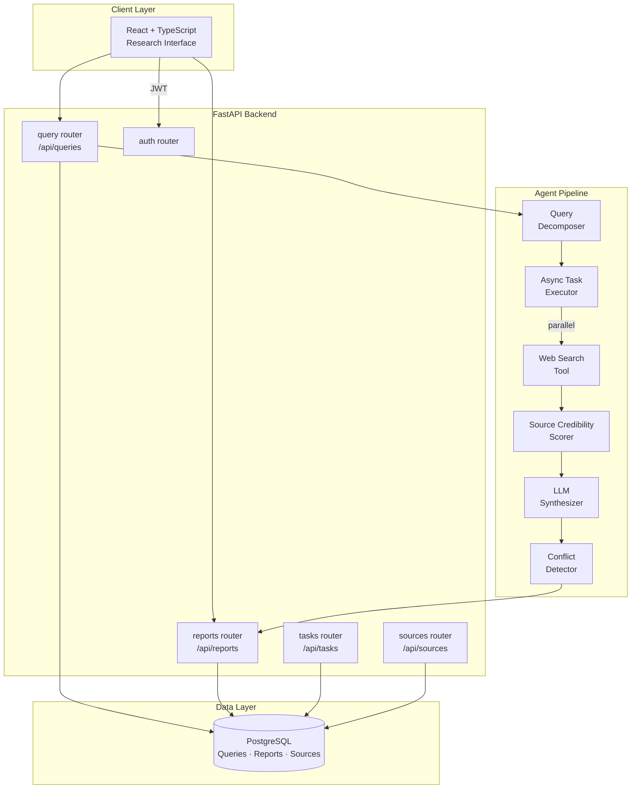

# Europa

**Autonomous Research & Intelligence Agent**

[**🔗 View Live Preview →**](https://www.perplexity.ai/computer/a/europa-preview-project-4-of-9-lCA5DWRgQoa4AN6VYPXAUQ)

> An autonomous multi-step research agent that decomposes a natural language query into sub-tasks, executes parallel web research, synthesizes findings with source credibility scoring, and delivers structured intelligence reports.

---

## 👋 For Recruiters

This is a **student portfolio project**, not a product. It is a runnable, tested demonstration of how I think about agent design, NLP, retrieval, and full-stack engineering. The fastest way to evaluate it:

1. Read **[docs/architecture.md](docs/architecture.md)** for the pipeline and trust model
2. Skim **[backend/app/services/](backend/app/services/)** — planner, validator, reporting, credibility scoring
3. Look at **[docs/resume-bullets.md](docs/resume-bullets.md)** for ATS-friendly bullets pulled from this work
4. Run the no-network demo: `python scripts/demo_pipeline.py`

CI runs ruff + 120+ pytest cases on every push. See **Limitations & Future Work** below for what is *not* claimed.

---

## ❓ Problem Statement

Research-style questions ("compare X across Y", "what's the current state of Z") need multiple sources, traceable citations, and an honest signal about confidence — not a single LLM monologue. This project explores how to:

- decompose a question into targeted sub-questions,
- retrieve and score sources by credibility,
- synthesize findings that link back to specific source excerpts,
- and flag contradictions and unsupported claims rather than hiding them.

The goal is not to replace a human researcher; it is to produce a **first-pass evidence pack** a human can verify quickly.

---

## 🎯 What I Built & Why

Large language models are powerful, but a single-turn query is often insufficient for complex research tasks. I built Europa to practice agentic system design — how you decompose tasks, manage tool calls, validate sources, and synthesize outputs across multiple steps:

- **Query decomposition** — a planning step breaks the user’s question into targeted sub-queries, improving retrieval precision vs. a single broad search
- **Parallel async execution** — sub-tasks run concurrently, cutting total research latency significantly on multi-step queries
- **Source credibility scoring** — retrieved sources are ranked by domain authority, recency, and citation signals before synthesis, reducing hallucination risk
- **Structured report output** — findings are assembled into a structured report with citations, confidence scores, and a conflict-detection flag for contradictory sources

---

## 🏗️ Architecture



---

## 📷 Features

- **Query decomposition** — automatic sub-query planning for complex research questions
- **Parallel async execution** — concurrent sub-task runners for reduced latency
- **Source credibility scoring** — domain authority, recency, and citation ranking
- **Structured intelligence reports** — cited findings with confidence scores and conflict flags
- **Research history** — query logs, report versioning, and source provenance tracking
- **React research interface** — real-time task progress, source cards, and report viewer
- **Docker Compose** — one-command local stack

---

## 🛠️ Tech Stack

| Layer | Technology |
|---|---|
| Backend API | FastAPI + SQLAlchemy + PostgreSQL |
| Agent Orchestration | Custom async pipeline + LLM integration |
| Frontend | React + Vite + TypeScript |
| Infra | Docker Compose + GitHub Actions CI |

---

## 🚀 Quick Start

```bash
docker compose up --build
# Backend API docs: http://localhost:8000/docs
# Frontend:         http://localhost:5173
```

### Local Development
```bash
cd backend && pip install -e .[dev]
cp .env.example .env   # add your LLM API key
uvicorn app.main:app --reload

cd frontend && npm ci && npm run dev
```

### Quality Checks
```bash
make lint && make test
```

---

## 🗂️ Repository Structure

```
backend/    FastAPI API, agent pipeline, query decomposition, credibility scoring, tests
frontend/   React research interface
data/       Sample sources and a sample report (mock data, for the demo)
docs/       Architecture, API reference, demo walkthrough, resume bullets
scripts/    Standalone demo entry points (no DB / no network)
.github/    CI workflows, issue / PR templates
```

---

## 📝 Key Learnings

- Query decomposition meaningfully improves retrieval quality — targeted sub-queries outperform a single broad search on complex topics
- Source credibility scoring is the practical alternative to retrieval hallucination: rank by authority, not just relevance
- Async parallel execution is essential for agentic systems; sequential tool calls at human-readable latency make the agent feel broken

---

## 🧪 Sample Data & Demo

A self-contained demo runs the planner + summarizer + citation system against mock sources, with no database or network:

```bash
python scripts/demo_pipeline.py
```

Inputs and an illustrative output report live under `data/sample/`.

---

## 📚 Docs

- [docs/architecture.md](docs/architecture.md) — pipeline and trust model
- [docs/api.md](docs/api.md) — backend API reference
- [docs/demo-script.md](docs/demo-script.md) — portfolio walkthrough
- [docs/runbook.md](docs/runbook.md) — operator checks
- [docs/resume-bullets.md](docs/resume-bullets.md) — ATS-friendly resume bullets

---

## ⚠️ Limitations & Future Work

**Limitations — read before using:**
- **Outputs require human verification.** Confidence scores and evidence-coverage metrics are heuristics, not fact-checks. Anything used for a decision must be independently verified.
- **Sample/mock sources do not replace live research.** The default `SearchTool` and demo data are stubs; wiring real retrieval is required for non-toy use.
- **Not production-ready.** This is a student portfolio project — no real deployment, no real users, no SLAs, no guarantees about availability, security, or correctness.
- **Synchronous execution.** The agent runs inside the HTTP request; long queries hold the connection. A real deployment would move the pipeline behind a job queue.
- **Hallucination risk remains.** Credibility scoring, citation tracking, contradiction detection, and unsupported-claim flagging reduce risk but do not eliminate it.

**Planned / future work:**
- Async job queue (Celery / RQ) so the agent can run beyond a single HTTP request
- Pluggable retrieval backends (Brave / Tavily / SerpAPI) gated behind a single `SearchTool` interface
- LLM-backed abstractive summarization as an alternative to the extractive default
- Richer evaluation: a small labeled set + per-pipeline-stage accuracy metrics
- Per-source freshness decay in the credibility scorer

---

## 🎓 Project Context

Built by **Ryan Bush**, University of Maryland Information Science (General Business minor; prior Electrical Engineering coursework), as a portfolio project to practice agentic system design, NLP, and full-stack engineering. It is a student-built learning project, not a product.

Suggested GitHub topics: `autonomous-agent`, `research-assistant`, `nlp`, `information-retrieval`, `summarization`, `fastapi`, `python`, `portfolio-project`.

---

## 📄 License

MIT
