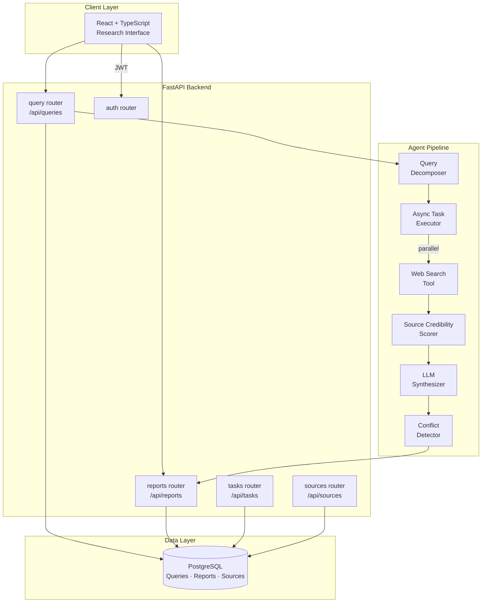

# Europa

**Autonomous Research & Intelligence Agent**

[**🔗 View Live Preview →**](https://www.perplexity.ai/computer/a/europa-preview-project-4-of-9-lCA5DWRgQoa4AN6VYPXAUQ)

> An autonomous multi-step research agent that decomposes a natural language query into sub-tasks, executes parallel web research, synthesizes findings with source credibility scoring, and delivers structured intelligence reports.

---

## 🎯 What I Built & Why

Large language models are powerful, but a single-turn query is often insufficient for complex research tasks. I built Europa to practice agentic system design — how you decompose tasks, manage tool calls, validate sources, and synthesize outputs across multiple steps:

- **Query decomposition** — a planning step breaks the user’s question into targeted sub-queries, improving retrieval precision vs. a single broad search
- **Parallel async execution** — sub-tasks run concurrently, cutting total research latency significantly on multi-step queries
- **Source credibility scoring** — retrieved sources are ranked by domain authority, recency, and citation signals before synthesis, reducing hallucination risk
- **Structured report output** — findings are assembled into a structured report with citations, confidence scores, and a conflict-detection flag for contradictory sources

---

## 🏗️ Architecture



---

## 📷 Features

- **Query decomposition** — automatic sub-query planning for complex research questions
- **Parallel async execution** — concurrent sub-task runners for reduced latency
- **Source credibility scoring** — domain authority, recency, and citation ranking
- **Structured intelligence reports** — cited findings with confidence scores and conflict flags
- **Research history** — query logs, report versioning, and source provenance tracking
- **React research interface** — real-time task progress, source cards, and report viewer
- **Docker Compose** — one-command local stack

---

## 🛠️ Tech Stack

| Layer | Technology |
|---|---|
| Backend API | FastAPI + SQLAlchemy + PostgreSQL |
| Agent Orchestration | Custom async pipeline + LLM integration |
| Frontend | React + Vite + TypeScript |
| Infra | Docker Compose + GitHub Actions CI |

---

## 🚀 Quick Start

```bash
docker compose up --build
# Backend API docs: http://localhost:8000/docs
# Frontend:         http://localhost:5173
```

### Local Development
```bash
cd backend && pip install -e .[dev]
cp .env.example .env   # add your LLM API key
uvicorn app.main:app --reload

cd frontend && npm ci && npm run dev
```

### Quality Checks
```bash
make lint && make test
```

---

## 🗂️ Repository Structure

```
backend/    FastAPI API, agent pipeline, query decomposition, credibility scoring, tests
frontend/   React research interface
docs/       Architecture, agent design, demo walkthrough
```

---

## 📝 Key Learnings

- Query decomposition meaningfully improves retrieval quality — targeted sub-queries outperform a single broad search on complex topics
- Source credibility scoring is the practical alternative to retrieval hallucination: rank by authority, not just relevance
- Async parallel execution is essential for agentic systems; sequential tool calls at human-readable latency make the agent feel broken

---

## 📄 License

MIT
